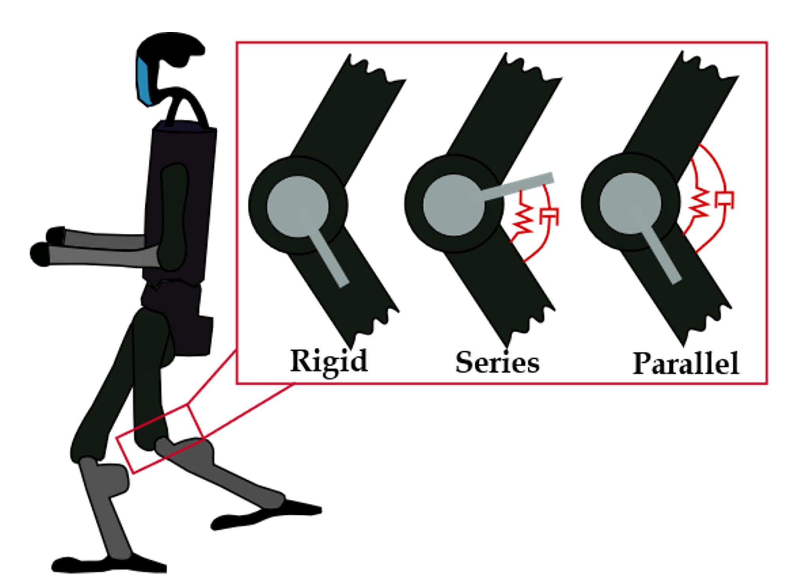

#  Soft Joints Concept

The figure below illustrates the humanoid with **rigid**, **parallel elastic**, and **series elastic** joint configurations:

<p align="center">
  
</p>

<p align="center">
  
</p>


# Humanoid Walking with Variable Stiffness (Isaac Gym)

This repository contains the simulation environments, training, and evaluation scripts used in our paper:

> *Compliant Pneumatic Feet for Online Adaptive Stiffness Control in Humanoid Walking* (2025)  
> Authors: I.Frizza, M.Austin, K.Nakajima

We study humanoid locomotion with:
- **Rigid joints** (baseline torque control)
- **Soft joints with fixed stiffness/damping**
- **Variable stiffness/damping joints** (learned by RL)
- **Parallel vs Series elastic configurations**

The code is built on top of [Isaac Gym](https://developer.nvidia.com/isaac-gym), `legged_gym`, and `unitree_rl_gym`.

---

# Installation

1. Install [Isaac Gym (preview 4)](https://developer.nvidia.com/isaac-gym).
2. Create a conda environment:
   ```bash
   conda create -n isaac11 python=3.8
   conda activate isaac11
   pip install -r requirements.txt


# The Five Configurations (What to Set)

Edit the flags at the top of `h1_config.py` to switch setups:

| Case | Description                                                   | `VARIABLE_STIFFNESS` | `FIXED_STIFFNESS_PRESET` | `PARALLEL` | `SERIE` |
|:----:|---------------------------------------------------------------|:---------------------:|:-------------------------:|:----------:|:------:|
| a)   | **Rigid joints** (baseline torque control; k=0, d=0)         | False                 | 'rigid'                   | True       | False   |
| b)   | **Soft, fixed (parallel)**                                   | False                 | 'soft'                    | True       | False   |
| c)   | **Soft, variable (parallel)** — RL learns k,d                 | True                  | _ignored_                 | True       | False   |
| d)   | **Soft, fixed (series)**                                     | False                 | 'soft'                    | False      | True    |
| e)   | **Soft, variable (series)** — RL learns k,d                   | True                  | _ignored_                 | False      | True    |

**Notes**
- `FIXED_STIFFNESS = not VARIABLE_STIFFNESS` (auto—don’t set both).
- Exactly one of `PARALLEL` or `SERIE` must be `True`.
- For case (a) rigid, `k=d=0` so `PARALLEL=True` is harmless.
- Variable setups (c,e) output 10 stiffness + 10 damping values (one per leg DOF), bounded by `max_stiffness`/`max_damping`.

> See **docs/README_H1_Config.md** for details and examples.
